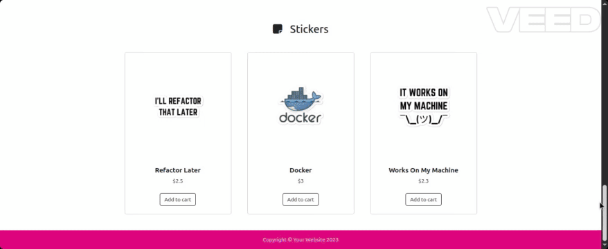
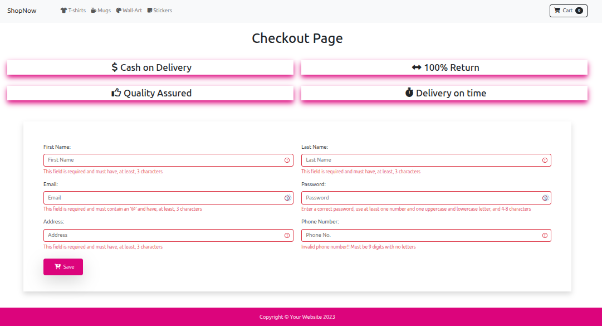
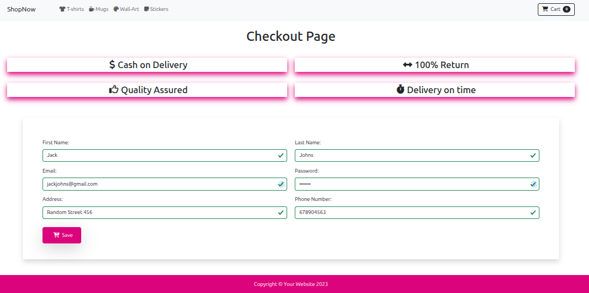

# 📚 Stage 2.2 - E-Commerce


## 🧠 Goals

- Put into practice JavaScript concepts.
- Learn to manipulate a dataset.
- Divide our code into functions and know how to reuse them.

## 🎥 Preview

### 🛍️ Store View


---

### ❌ Invalid Form


---

### ✅ Valid Form


## 🛠️ Getting Started

### 1️⃣ Clone this repository

```bash
git clone https://github.com/DiegoAPaez/2.2-E-Commerce.git
cd 2.2-E-Commerce
```

### 2️⃣ Install Dependencies

Make sure you have Node.js installed. Then install the packages:

```bash
npm install
```

### 3️⃣ Switch to `develop` branch

```bash
git checkout develop
```

Explore branches `level-1` and `level-3` to access specific tasks. A README file is included with details.

## 📁 Project Structure

```
📦 develop
┣ 📂 data/
┣ 📂 images/
┣ 📂 scripts/
┣ 📂 styles/
┣ 📄 .babelrc
┣ 📄 checkout.html
┣ 📄 index.html
┗ 📄 README.md
```

## 🛠 Technologies Used

- Base project:
    - HTML5
    - CSS3 (Bootstrap)
- Updates:
    - JavaScript
    - Babel    


***Babel*** is essential for using JavaScript modules as it transpiles modern JavaScript syntax (like ES modules) into backward-compatible versions, allowing you to write code with import/export statements that works across browsers including older ones that don't natively support ES modules.

## 🤝 Contributions

Contributions are welcome. Please follow the [project's guidelines](CONTRIBUTING.md) for submitting changes.

## ⏳ Project Status

 